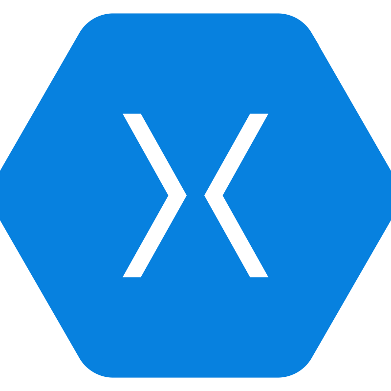

<h1 align="center">Hi 👋, I'm Isaac Portilla</h1>
<h3 align="center">I am a passionate Full-Stack developer in Microsoft on-premise or cloud environments.</h3>

- 🌱 I’m currently learning **Angular**

- 📫 How to reach me **iipg2244@hotmail.com**

- 📄 Know about my experiences [https://www.iipg2244.com](https://www.iipg2244.com)

<h3 align="left">Connect with me:</h3>

    
    
    

<h3 align="left">Languages and Tools:</h3>

        
    
    
       
    
        
    
    
      
    
      
             
    
         
    
    
    
        
        
    
    
    
    
    

<h3 align="left">Support:</h3>

    

